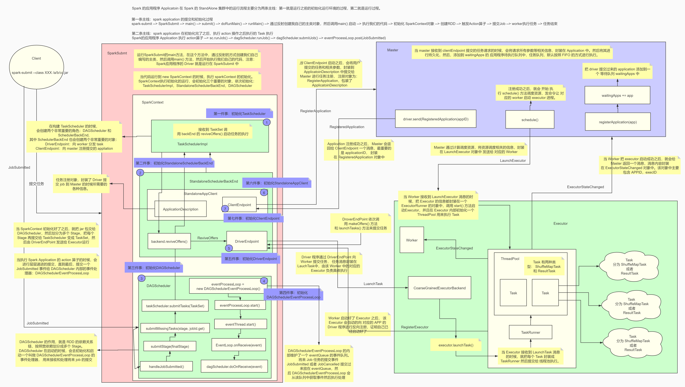

[TOC]

# 上课须知

课程主题：Spark 分布式计算引擎 SparkCore 第四次课 - 源码剖析
上课时间：2020-10.09 20:00 - 23:00
课件休息：21:30 左右 休息10分钟
课前签到：如果能听见音乐，能看到画面，请在直播间扣 666 


# 上次内容总结

上次所有内容复习：

```
1、Spark RPC（Endpoint：DriverEndpoint ClientEndpoint）
2、利用 akka（endpoint类似于actor） 模拟实现 YARN（Flink 就是基于 akka实现的 RPC）
3、Spark Standalone 集群启动脚本start-all.sh 分析
4、Master 启动分析
5、Worker 启动分析
6、Spark APP 提交脚本 spark-submit　脚本分析
7、SparkSubmit 分析(重点是进入main方法，通过反射的方式运行用户编写的application的主类main方法)
8、SparkContext 初始化
```

spark应用程序的标准写法：

```
1、初始化sparkContext sparkSession
2、
3、
4、执行action提交job
5、stop
```

应用程序执行的三大核心组件：

```
1、TaskScheduler：提交Task的
2、BackEnd：通信终端（SchedulerBackEnd， ExecutorBackEnd）
	DriverEndpoint：application中的Task的调度执行
	ClientEndpoint：负责和Master打交道
3、DAGScheduler：构建DAG，并且进行DAG的stage切分
```

初始化成功之后，就是调用 taskScheduler.start() 来启动。启动运行程序所需要的 Driver 和 Executor


# 本次内容预告

一个 Spark 应用程序的完整执行流程：

```
1、编写 Spark Application 应用程序
2、打 jar 包，通过 spark-submit 提交执行
3、SparkSubmit 提交执行
4、执行 Spark Application 的 main 方法
5、初始化 SparkContext，这一步主要是把执行 Application 所需要的一个 Driver 和多个 Executor 启动起来
6、执行到 Action 算子，这个阶段会产生 DAG 血缘依赖关系，但是并么有真正执行
7、执行 Action 算子，生成一个 Job 提交执行
8、DAGScheduler 会对提交的 Job 进行 Stage 切分
9、TaskSchedule 通过 TaskSet 获取 job 的所有 Task，然后序列化分给 Exector
.... 
shuffle
```

RDD任务切分中间分为：Application、Job、Stage 和 Task

```
1、Application：初始化一个 SparkContext 即生成一个 Application；
2、Job：一个 Action 算子就会生成一个 Job；
3、Stage：Stage 等于宽依赖的个数加 1；
4、Task：一个 Stage 阶段中，最后一个 RDD 的分区个数就是 Task 的个数。
```

注意：Application->Job->Stage->Task每一层都是1对n的关系


## 本次内容概述

```
1、Spark Application 提交流程分析
2、Spark Application 的 DAG 生成和 Stage 切分分析
3、Spark 的 Task 分发和执行源码分析
4、Spark 的 Shuffle 机制源码分析
```


## SparkContext初始化复习




## Spark Application 提交分析

入口：spark application 中的 action 算子！（SparkPi 程序中的 reduce 函数）

以 SparkPi 程序举例：reduce() 算子就是提交 job 的入口

最后到：

```
dagScheduler.handleJobSubmitted(jobId, rdd, func, partitions, callSite, listener, properties)
```

从此，任务的提交就交给了 dagScheduler


## Spark App Stage 切分分析

入口：EventLoop 中的 eventQueue.take() 方法

如果任务提交，则有 JobSubmitted 事件提交到 eventQueue 中，则 eventQueue.take() 阻塞返回，此时的 event 就是 JobSubmitted。

根据事件机制，跳转到：DAGScheduler.handleJobSubmitted()

两个核心的方法：

```java
// stage切分入口
finalStage = createResultStage(finalRDD, func, partitions, jobId, callSite)
```

```java
// 提交stage执行入口
submitStage(finalStage)
```

方法依赖关系：

```
1、createResultStage(传入finalRDD获得ResultStage) ->2
2、getOrCreateParentStages(传入rdd获得父stage) ->3->4
	3、getShuffleDependencies(传入rdd获得宽依赖)
	4、getOrCreateShuffleMapStage(传入宽依赖获得ShuffleMapStage) ->5->6
		5、getMissingAncestorShuffleDependencies(传入一个rdd获得所有宽依赖) ->3
		6、createShuffleMapStage(传入宽依赖获得ShuffleMapStage) ->2
```


```
21:57 继续
21:57 继续
21:57 继续
21:57 继续
21:57 继续
21:57 继续
```


## Spark Task 分发和执行分析

入口：

```java
taskScheduler.submitTasks(new TaskSet(tasks.toArray, stage.id, stage.latestInfo.attemptNumber, jobId, properties))
```

```
backend.reviveOffers()
```

总结一下：

```
1、用户编写 spark 应用程序
2、达成jar包
3、通过spark-submit 提交执行
4、sparkSessioin sparkContext 初始化
5、执行action算子
6、sparkContext.runJob()
7、dagScheduler.handleJobSubmitted()
8、dagScheduler.runJob()
	createResultStage() stage切分
	submitStage()
9、taskScheduler.submitTasks(new TaskSet())
10、schedulerBackEnd.reviveOffers();
11、Driver发送 LaunchTask 消息给 Executor 
12、Executor 就会封装Task 为一个 TaskRunner 对象，提交给该 Executor 的线程池执行
13、Executor 执行的Task 有可能是 ShuffleMapTask,也有可能是ResultTask
14、ShuffleMapTask 会后续的 Shuffle操作，具体有 Writer 完成
```


## Spark Suffle 源码分析

入口：

```
Task.runTask()
```


# 总结

两次课，讲完一个 Application 在 SparkStandalone 模式下的完整执行流程。

